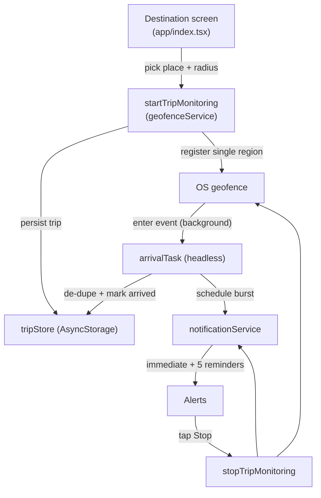

# Wake Me There

A cross-platform (iOS + Android) React Native app that watches a single
destination geofence in the background and fires a strong arrival alert when you
get close — so you know when to get off during public transport or unfamiliar
trips.

Built with Expo SDK 57, Expo Router, `expo-location` + `expo-task-manager`
(OS geofencing) and `expo-notifications`. It requires a **native development
build** — it will not work in Expo Go.

## How it works



- One active trip at a time. The trip is persisted so it can be restored and the
  native geofence reconciled every time the app launches or returns to the
  foreground (`reconcileMonitoring`).
- Arrival triggers a **bounded alert burst**: one immediate notification plus 5
  follow-ups spaced 60s apart (`ALERT_REPEAT_COUNT` / `ALERT_INTERVAL_SECONDS`).
  Tapping **Stop** cancels pending reminders, dismisses delivered ones and stops
  the geofence.

### Platform-specific alerting

- **Android:** a high-importance (`MAX`) notification channel with a strong
  custom vibration pattern (`ANDROID_VIBRATION_PATTERN`).
- **iOS:** standard Time Sensitive notifications. iOS does not expose a custom
  vibration pattern to apps, and this app does **not** use Critical Alerts.

## Project layout

| Path | Responsibility |
| --- | --- |
| `app/_layout.tsx` | Router + notification response handling (incl. app-closed taps) |
| `app/index.tsx` | Destination search / map pin / radius / permissions UX |
| `app/trip.tsx` | Active trip: distance, health, Stop button, arrival state |
| `src/background/arrivalTask.ts` | Headless geofence task (defined at module scope) |
| `src/services/geofenceService.ts` | Start / stop / reconcile the single geofence |
| `src/services/notificationService.ts` | Channel, category, alert burst, cleanup |
| `src/services/permissionsService.ts` | Location + notification permission flow |
| `src/storage/tripStore.ts` | Persisted trip + arrival de-duplication |
| `src/utils/geo.ts` | Haversine distance, radius validation, formatting |

## Prerequisites

- Node 18+ (Node 24 recommended).
- Xcode (iOS) and/or Android Studio + SDK for local native builds.
- An Android **Google Maps API key** (iOS uses Apple Maps, no key needed).

## Setup

```bash
npm install
cp .env.example .env   # then add your GOOGLE_MAPS_API_KEY (Android only)
```

The Android Maps key is read from `GOOGLE_MAPS_API_KEY` in `app.config.ts`, so it
is never committed. `.env` is git-ignored.

## Running (development build required)

Geofencing and background alerts need a dev build, not Expo Go:

```bash
# Generate native projects and run on a device/simulator
npx expo run:android
npx expo run:ios

# Or build with EAS and start the dev server
npx eas build --profile development --platform android
npx eas build --profile development-device --platform ios
npm start   # expo start --dev-client
```

`eas.json` defines `development`, `development-device`, `preview` and
`production` profiles and forwards `GOOGLE_MAPS_API_KEY` from the environment.

## Quality checks

```bash
npm run typecheck   # tsc --noEmit
npm run lint        # eslint
npm test            # jest (logic/services, Expo modules mocked)
```

Tests cover radius validation, haversine distance, trip persistence, arrival
de-duplication, notification scheduling/cancellation, and geofence service
state.

## Important limitations (please read before relying on it)

Background geofencing is best-effort and controlled by the OS. This app cannot
guarantee an instant, continuously ringing alarm:

- **Latency:** background arrival delivery commonly lags a few minutes (Android
  averages ~2–3 min, up to ~6 min while stationary; iOS applies a boundary
  cushion). Set a generous radius and don't rely on second-level precision.
- **Radius:** values under ~200 m are unreliable. Minimum allowed is 100 m.
- **No continuous vibration:** a normal app cannot vibrate until dismissed. We
  use a bounded burst of high-priority notifications instead.
- **Silent mode / DND:** alerts do **not** bypass silent mode or Do Not Disturb.
- **Force-quit:** if you swipe the app away, arrival detection may stop on both
  platforms. Leave it running in the background during your trip.
- **Reboot (Android):** OS geofences are cleared on reboot. Reopen the app to
  re-register (the app reconciles on launch). Automatic re-registration after
  reboot would require additional native `BOOT_COMPLETED` work.

## Physical-device test matrix

Simulators can validate event plumbing, but permissions, lifecycle, OEM battery
restrictions, force-quit and reboot must be verified on **real iPhone and
Android devices**. Test each of the following by walking/driving across the
geofence boundary (or using Xcode/Android Studio location simulation):

1. Foreground: app open, cross boundary → immediate alert + reminders.
2. Background: app backgrounded, screen on.
3. Locked screen.
4. OS-terminated (memory pressure) — iOS may relaunch; Android may not.
5. Force-quit (swiped away) — expected to not fire; verify the in-app warning.
6. Permission downgrade (revoke Always / notifications) — health state warns.
7. Device location services disabled — health state warns.
8. iOS Background App Refresh off.
9. Android battery optimization / restricted background.
10. Reboot, then reopen app → geofence re-registers.
11. Stop action from a notification → alerts stop and geofence is removed.
12. Radius sanity: 200 m vs 1 km, confirm alert timing feels right.
